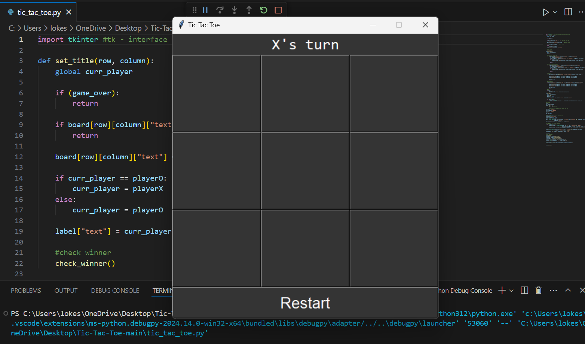
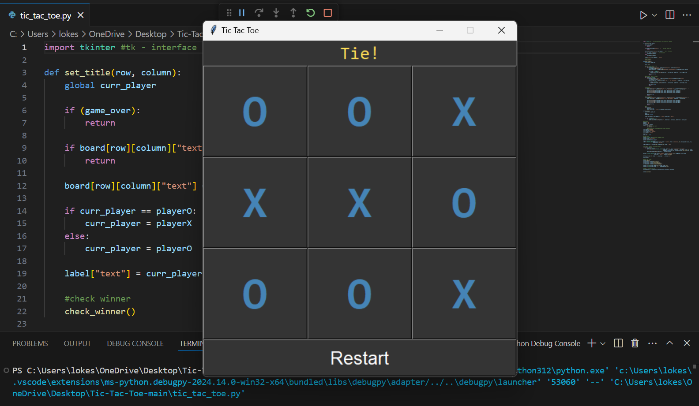
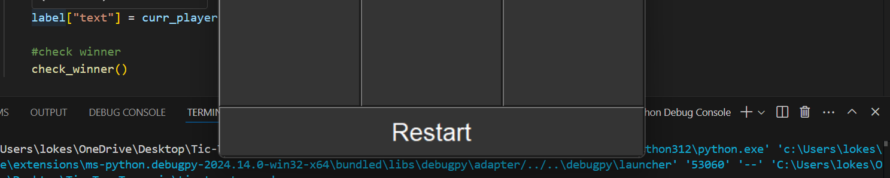
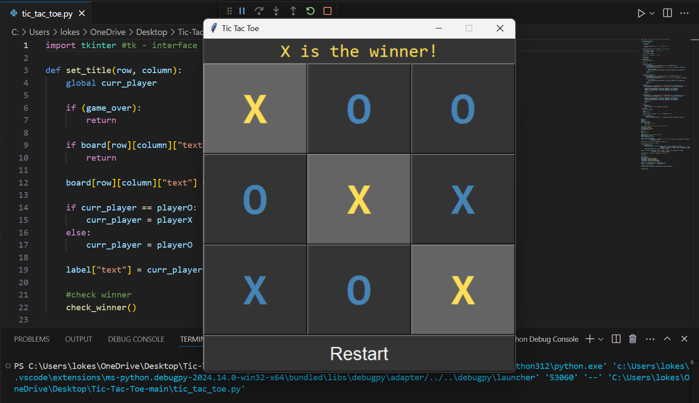

# Dynamic Tic Tac Toe Game with Python Tkinter 🎮✨
An interactive and visually appealing Tic Tac Toe game built using Python and Tkinter. This project showcases a modern GUI design with responsive gameplay mechanics, player turn tracking, winner determination, and restart functionality.

---

## Features

* 🔄 **Dynamic Gameplay:** Allows two players to alternate turns seamlessly.
* 🏆 **Winner Detection:** Highlights the winning combination (horizontal, vertical, or diagonal).
* 🤝 **Tie Condition:** Detects and declares a tie when the board is full.
* 🎨 **Custom Styling:** Incorporates Python logo-inspired colors for an engaging look.
* 🚀 **Restart Option:** A single click to restart the game and play again.
* 🖥️ **Responsive Window Design:** Auto-centers on any screen for a polished experience.

---

## 🎥 Demo
👀 **Check out how it works!**

1. Empty Grid

2. Tie Condition

3. Restart Option

4. Winner Detection


---


## Techonlogy Used
* Python 🐍
* Tkinter for GUI Development

---

## How to Run
1. Clone the repository:
```bash
   git clone https://github.com/lokeshvloki/dynamic-tic-tac-toe.git
   cd dynamic-tic-tac-toe  
```
2. Ensure Python 3.8+ is installed on your system.
3. Run the game:
```bash
python tic_tac_toe.py
```
4. Enjoy the game and challenge your friends! 🎉

---

## 📂 Project Structure
```bash
dynamic-tic-tac-toe/
├── tic_tac_toe.py     # Main game script 
└── README.md          # Project documentation
```

---

## 🤝 Contributing
Contributions are welcome! If you have ideas to improve the game or want to report a bug:

1. Fork this repository.
2. Create a new branch
```bash
git checkout -b feature-improvement  
```
3. Commit your changes:
```bash
git commit -m "Add a cool new feature"
```
4. Push your branch and submit a pull request.

---

## 🖌️ Inspiration
The project colors are inspired by Python’s official logo, blending creativity with functionality.

---

## 📧 Contact
- 👤 **Lokesh V**
- 📧 **Email:** lokeshv2403@gmail.com
- 📂 **LinkedIn:** [lokeshV](https://www.linkedin.com/in/lokesh-v-13873a284?utm_source=share&utm_campaign=share_via&utm_content=profile&utm_medium=android_app)

